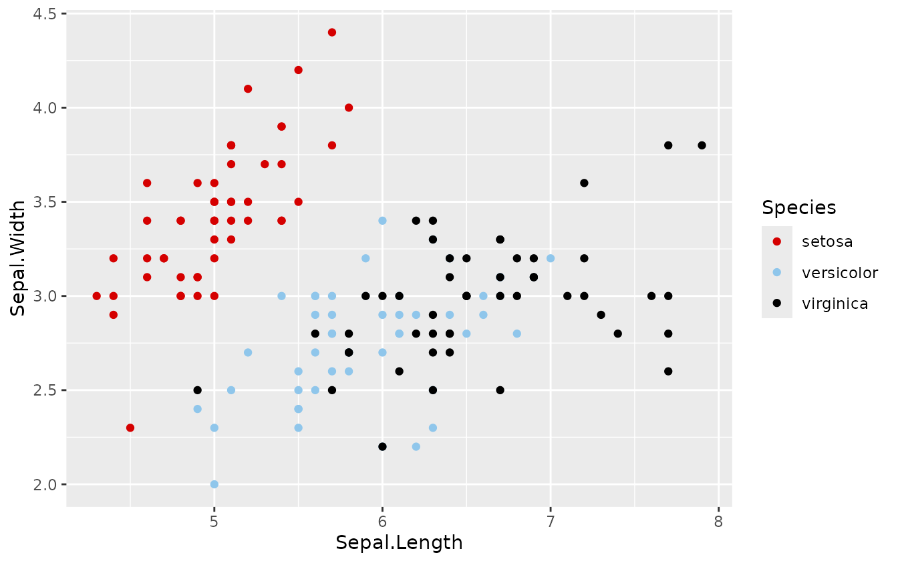
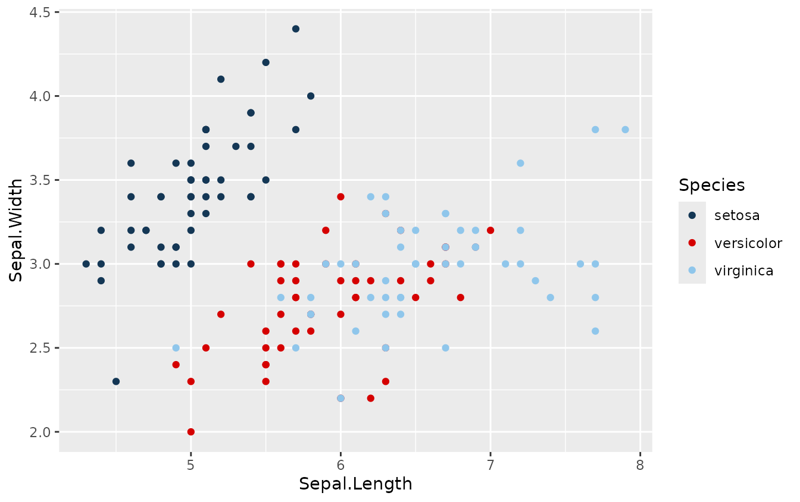
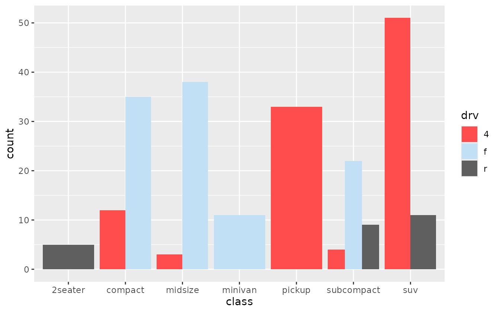
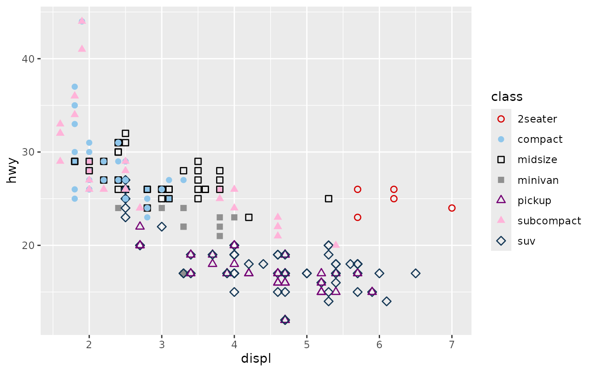
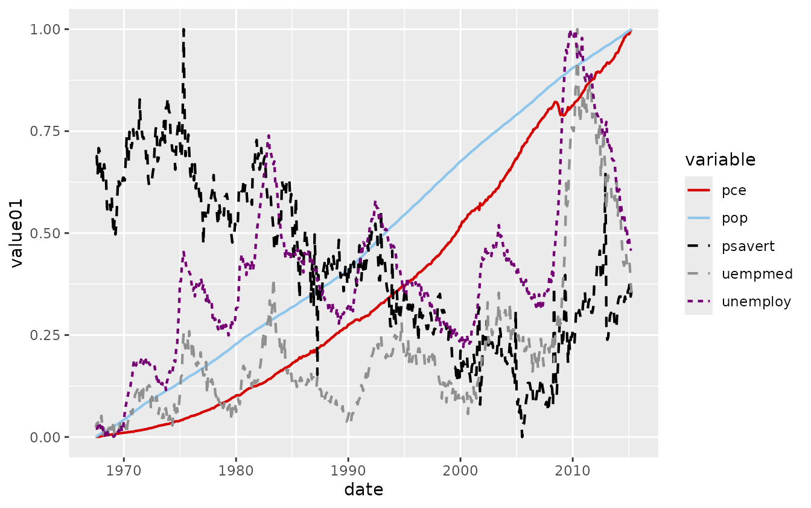
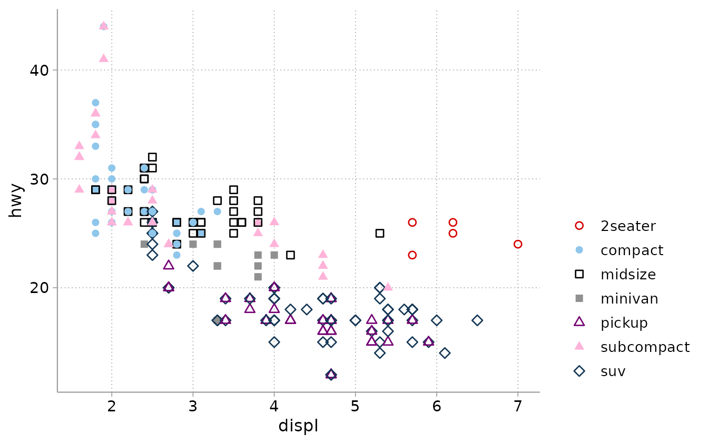
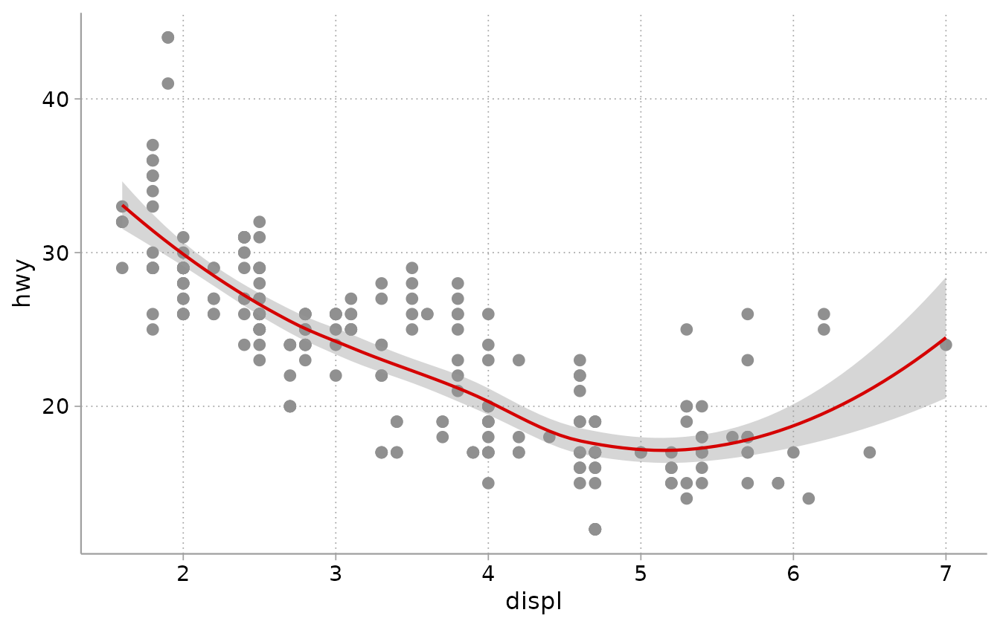
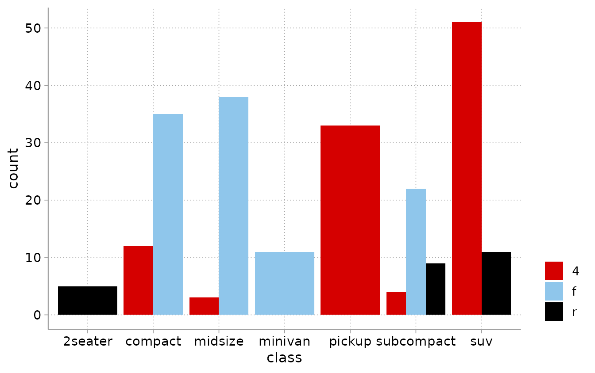

# Getting started with cleanplots

cleanplots provides publication-ready defaults for ggplot2: a color
palette designed to be aesthetically pleasing, colorblind-friendly, and
distinguishable when printed in black & white, along with matching
marker shapes, line patterns, and a clean theme. It ports the
[cleanplots](https://www.trentonmize.com/software/cleanplots) graphing
scheme originally developed for Stata, so figures made in R and Stata
look like siblings.

The package is **layered**: you can use as little or as much as you
want. This vignette walks from the lightest touch (colors only) to the
full setup (one call that changes everything).

``` r

library(ggplot2)
library(cleanplots)
```

## 1. Colors only

If all you want is the cleanplots colors – leaving the theme, sizes, and
everything else exactly as they were – add
[`scale_color_cleanplots()`](https://tdmize.github.io/cleanplots/reference/scale_color_cleanplots.md)
(or
[`scale_fill_cleanplots()`](https://tdmize.github.io/cleanplots/reference/scale_color_cleanplots.md))
to a plot, just like any other palette package:

``` r

ggplot(iris, aes(Sepal.Length, Sepal.Width, color = Species)) +
  geom_point() +
  scale_color_cleanplots()
```



Both scales take the same options:

- `palette`: `"default"` (the main colors) or `"bars"` (softer versions
  for bars, areas, and pies – more on this below)
- `order`: use the colors in a different order, e.g.
  `order = c(7, 1, 2)` starts with navy
- `reverse`: reverse the palette

``` r

ggplot(iris, aes(Sepal.Length, Sepal.Width, color = Species)) +
  geom_point() +
  scale_color_cleanplots(order = c(7, 1, 2))
```



To use individual colors manually,
[`cleanplots_colors()`](https://tdmize.github.io/cleanplots/reference/cleanplots_colors.md)
returns hex codes by name:

``` r

cleanplots_colors()
#>       red    ltblue     black      gray    purple      pink      navy    ltgray 
#> "#D50000" "#8FC6EB" "#000000" "#909090" "#740074" "#FFB3D9" "#143755" "#C0C0C0" 
#>    dkgray  lavender 
#> "#404040" "#D9D7F0"
cleanplots_colors("red", "navy")
#>       red      navy 
#> "#D50000" "#143755"
```

## 2. The two palettes

The **main palette** is used for markers, lines, and confidence
intervals. It alternates darker and lighter colors so that the first
several groups remain distinguishable even when printed in black &
white, and it contains no red–green pair (the most common form of
colorblindness).

The **bar palette** contains softer versions of the same colors. Bars,
areas, and pie slices use far more ink than points and lines, so
full-strength colors overwhelm; the Stata scheme automatically fades
them, and this package provides the same rendered colors:

``` r

ggplot(mpg, aes(class, fill = drv)) +
  geom_bar(position = "dodge") +
  scale_fill_cleanplots(palette = "bars")
```



## 3. Shapes and line patterns

Color alone reliably distinguishes about 4–5 groups. Beyond that – or
for black & white printing and colorblind readers – vary marker shapes
and line patterns too.
[`scale_shape_cleanplots()`](https://tdmize.github.io/cleanplots/reference/scale_shape_cleanplots.md)
and
[`scale_linetype_cleanplots()`](https://tdmize.github.io/cleanplots/reference/scale_shape_cleanplots.md)
provide the same assignments as the Stata scheme, designed so that any
two groups sharing a shape or a line pattern always differ strongly in
lightness:

- **Shapes**: hollow circle, solid circle, hollow square, solid square,
  hollow triangle, solid triangle, hollow diamond, solid diamond, plus,
  plus. Dark colors get hollow shapes; light colors get solid shapes.
- **Line patterns**: solid, solid, dashed, dashed, shortdash, shortdash,
  longdash, longdash, solid, solid.

``` r

ggplot(mpg, aes(displ, hwy, color = class, shape = class)) +
  geom_point(size = 2, stroke = 0.7) +
  scale_color_cleanplots() +
  scale_shape_cleanplots()
```



``` r

ggplot(economics_long, aes(date, value01, color = variable, linetype = variable)) +
  geom_line(linewidth = 0.75) +
  scale_color_cleanplots() +
  scale_linetype_cleanplots()
```



## 4. The theme

[`theme_cleanplots()`](https://tdmize.github.io/cleanplots/reference/theme_cleanplots.md)
applies the scheme’s layout: white background, no plot border, light
gray axis lines, dotted gridlines, a frameless legend at the lower
right, and black-outlined facet strips. Like any ggplot2 theme, add it
per plot:

``` r

ggplot(mpg, aes(displ, hwy, color = class, shape = class)) +
  geom_point(size = 2, stroke = 0.7) +
  scale_color_cleanplots() +
  scale_shape_cleanplots() +
  theme_cleanplots()
```


## 5. The full setup: `cleanplots_defaults()`

Adding scales and themes to every plot gets repetitive. One call at the
top of your script makes the whole session behave like Stata with the
cleanplots scheme set:

``` r

cleanplots_defaults()
```

After this, with **no scales or theme added**:

- every plot uses
  [`theme_cleanplots()`](https://tdmize.github.io/cleanplots/reference/theme_cleanplots.md);
- discrete `color` aesthetics use the main palette, and discrete `fill`
  aesthetics use the softer bar palette (as in Stata, where bars
  automatically get the faded colors);
- points are larger with heavier outlines (`size = 2`, `stroke = 0.7`),
  so the hollow marker shapes are clearly visible;
- lines are thicker (`linewidth = 0.75`); error bars, linereanges, and
  pointranges use 80% of that;
- [`geom_smooth()`](https://ggplot2.tidyverse.org/reference/geom_smooth.html)
  fit lines are cleanplots red with a light gray confidence band,
  instead of ggplot2’s blue.

``` r

ggplot(mpg, aes(displ, hwy, color = class, shape = class)) +
  geom_point() +
  scale_shape_cleanplots()
```



``` r

ggplot(mpg, aes(displ, hwy)) +
  geom_point(color = cleanplots_colors("gray")) +
  geom_smooth(method = "loess", formula = y ~ x)
```



All settings are arguments if you prefer different sizes:

``` r

cleanplots_defaults(base_size = 13, point_size = 2,
                    point_stroke = 0.7, line_width = 0.75,
                    smooth_color = "#D50000")
```

Everything remains overridable per plot: an explicit scale, theme, or
aesthetic always wins. For example, to use the main palette for a fill
instead of the automatic bar palette:

``` r

ggplot(mpg, aes(class, fill = drv)) +
  geom_bar(position = "dodge") +
  scale_fill_cleanplots(palette = "default")
```



**Undoing it**:
[`cleanplots_defaults()`](https://tdmize.github.io/cleanplots/reference/cleanplots_defaults.md)
sets session-wide state, which persists until you restart R. To reset
manually:

``` r

theme_set(theme_gray())
options(ggplot2.discrete.colour = NULL, ggplot2.discrete.fill = NULL)
update_geom_defaults("point", list(size = 1.5, stroke = 0.5))
```

## 6. A note on plot windows vs. saved figures

ggplot2 sizes (points, text, line widths) are absolute physical units. A
maximized plot pane on a large monitor is a big canvas, so elements look
smaller there than in a saved figure. Judge sizes from your exported
files (e.g., `ggsave("fig.png", width = 8, height = 5.5)`), which is
what ends up in papers and slides – or use the
[camcorder](https://cran.r-project.org/package=camcorder) package to
preview plots at their true export size.

## 7. Correspondence with the Stata scheme

For users moving between R and Stata, the mapping is:

| Stata | R |
|----|----|
| `set scheme cleanplots` | [`cleanplots_defaults()`](https://tdmize.github.io/cleanplots/reference/cleanplots_defaults.md) |
| `p1`–`p10` colors | [`scale_color_cleanplots()`](https://tdmize.github.io/cleanplots/reference/scale_color_cleanplots.md) |
| `p1bar`–`p10bar` colors at `intensity bar 70` | `scale_fill_cleanplots(palette = "bars")` |
| marker symbols (`symbol p1` …) | [`scale_shape_cleanplots()`](https://tdmize.github.io/cleanplots/reference/scale_shape_cleanplots.md) |
| line patterns (`linepattern p1line` …) | [`scale_linetype_cleanplots()`](https://tdmize.github.io/cleanplots/reference/scale_shape_cleanplots.md) |
| scheme layout settings | [`theme_cleanplots()`](https://tdmize.github.io/cleanplots/reference/theme_cleanplots.md) |

The hex values in both languages are computed from the same definitions
using Stata’s intensity-adjustment formulas, so colors match exactly.
The Stata scheme is available at
<https://www.trentonmize.com/software/cleanplots>.
