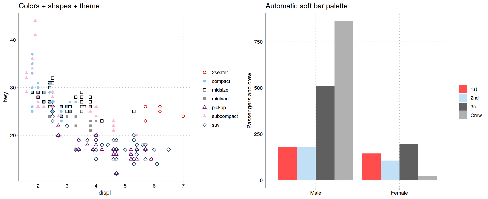

# cleanplots for R

Full documentation:
[tdmize.github.io/cleanplots](https://tdmize.github.io/cleanplots/)

Publication-ready defaults for **ggplot2**: the
[cleanplots](https://www.trentonmize.com/software/cleanplots) graphing
scheme by Trenton D. Mize. cleanplots provides professional-looking
figures with strong data visualization and accessibility defaults –
colors are chosen to be **colorblind-friendly** and to remain
**distinguishable when printed in black & white**, with matching marker
shapes and line patterns so that groups stay distinct across multiple
visual channels. A companion scheme is available for Stata, so figures
made in R and Stata share the same design.

## Installation

``` r

# install.packages("remotes")
remotes::install_github("tdmize/cleanplots")
```

## Usage

The quickest way to use cleanplots is one setup call: it sets the theme,
makes markers and lines larger and more visible, and applies the
cleanplots colors to all plots by default (main palette for `color`,
softer bar palette for `fill`):

``` r

library(ggplot2)
library(cleanplots)
cleanplots_defaults()

ggplot(mpg, aes(displ, hwy, color = class, shape = class)) +
  geom_point() +
  scale_shape_cleanplots()

cleanplots_save("my-figure.png")   # saves at a fixed 7 x 5 in, 300 dpi
```

Or apply the pieces individually per plot:

``` r

library(ggplot2)
library(cleanplots)

# Scatterplot with the main palette and theme
ggplot(iris, aes(x = Sepal.Length, y = Sepal.Width, color = Species)) +
  geom_point(size = 2) +
  theme_cleanplots() +
  scale_color_cleanplots()

# Bar charts use the softer bar/area palette
titanic <- aggregate(Freq ~ Class + Sex, data = as.data.frame(Titanic), sum)
ggplot(titanic, aes(Sex, Freq, fill = Class)) +
  geom_col(position = "dodge") +
  theme_cleanplots() +
  scale_fill_cleanplots(palette = "bars")

# Reorder or reverse the colors
scale_color_cleanplots(order = c(7, 1, 2))
scale_color_cleanplots(reverse = TRUE)

# Extract hex codes directly
cleanplots_colors()
cleanplots_colors("red", "navy")
cleanplots_colors(bars = TRUE)
```



## The palettes

**Main colors** (`palette = "default"`) – used for markers, lines, and
confidence intervals:

| \#  | Name     | Hex       | Definition     |
|-----|----------|-----------|----------------|
| 1   | red      | `#D50000` | `red*1.2`      |
| 2   | ltblue   | `#8FC6EB` | `eltblue*.9`   |
| 3   | black    | `#000000` | `black`        |
| 4   | gray     | `#909090` | `gs9`          |
| 5   | purple   | `#740074` | `purple*1.1`   |
| 6   | pink     | `#FFB3D9` | `pink*.3`      |
| 7   | navy     | `#143755` | `navy*1.3`     |
| 8   | ltgray   | `#C0C0C0` | `gs12`         |
| 9   | dkgray   | `#404040` | `gs4`          |
| 10  | lavender | `#D9D7F0` | `lavender*.35` |

**Bar/area colors** (`palette = "bars"`) – softer versions used for bar
charts, area plots, and pie charts, which use far more ink than points
and lines:

| \#  | Name     | Hex       | Definition          |
|-----|----------|-----------|---------------------|
| 1   | red      | `#FF4D4D` | `red` @ 70%         |
| 2   | ltblue   | `#C2E0F5` | `eltblue*.7` @ 70%  |
| 3   | black    | `#5F5F5F` | `black*.9` @ 70%    |
| 4   | gray     | `#B1B1B1` | `gs9` @ 70%         |
| 5   | purple   | `#AF5FAF` | `purple*.9` @ 70%   |
| 6   | pink     | `#FFDBEE` | `pink*.2` @ 70%     |
| 7   | navy     | `#5D7A93` | `navy*1.1` @ 70%    |
| 8   | ltgray   | `#D3D3D3` | `gs12` @ 70%        |
| 9   | dkgray   | `#909090` | `gs6` @ 70%         |
| 10  | lavender | `#E8E7F6` | `lavender*.3` @ 70% |

## Shapes and line patterns

Color alone reliably distinguishes about 4-5 groups. Beyond that – and
for black & white printing and colorblind readers – cleanplots varies
several visual channels at once:
[`scale_shape_cleanplots()`](https://tdmize.github.io/cleanplots/reference/scale_shape_cleanplots.md)
assigns hollow marker shapes to the dark colors and solid shapes to the
light colors, and
[`scale_linetype_cleanplots()`](https://tdmize.github.io/cleanplots/reference/scale_shape_cleanplots.md)
assigns line patterns (solid, solid, dashed, dashed, shortdash,
shortdash, longdash, longdash) so that any two groups sharing a shape or
pattern always differ strongly in lightness. Groups remain
distinguishable by color, by lightness, by marker shape and fill, and by
line pattern.

``` r

ggplot(mpg, aes(displ, hwy, color = class, shape = class)) +
  geom_point(size = 2) +
  theme_cleanplots() +
  scale_color_cleanplots() +
  scale_shape_cleanplots()
```

## Design goals

The palette alternates dark and light colors so the first several groups
are distinguishable by lightness alone when printed in black & white,
contains no red-green pair, and passes deuteranopia, protanopia, and
tritanopia simulation checks for the first five colors (minimum Delta-E
of about 21). Check the palette yourself at [Coloring for
Colorblindness](https://davidmathlogic.com/colorblind/#%23D50000-%238FC6EB-%23000000-%23909090-%23740074-%23FFB3D9-%23143755-%23C0C0C0-%23404040-%23D9D7F0).

## The theme

[`theme_cleanplots()`](https://tdmize.github.io/cleanplots/reference/theme_cleanplots.md):
white background, no plot border, light gray axis lines and ticks,
dotted light gray gridlines, a frameless, untitled legend at the right,
and black-outlined facet strips with bold labels. To restore a legend
title:

``` r

theme_cleanplots() + theme(legend.title = element_text())
```

## cleanplots for Stata

The original Stata scheme is available at
<https://www.trentonmize.com/software/cleanplots> or via
`net install cleanplots, from("https://tdmize.github.io/data/cleanplots") replace`.
Colors, marker symbols, line patterns, and layout match this package, so
figures made in R and Stata look like siblings.
